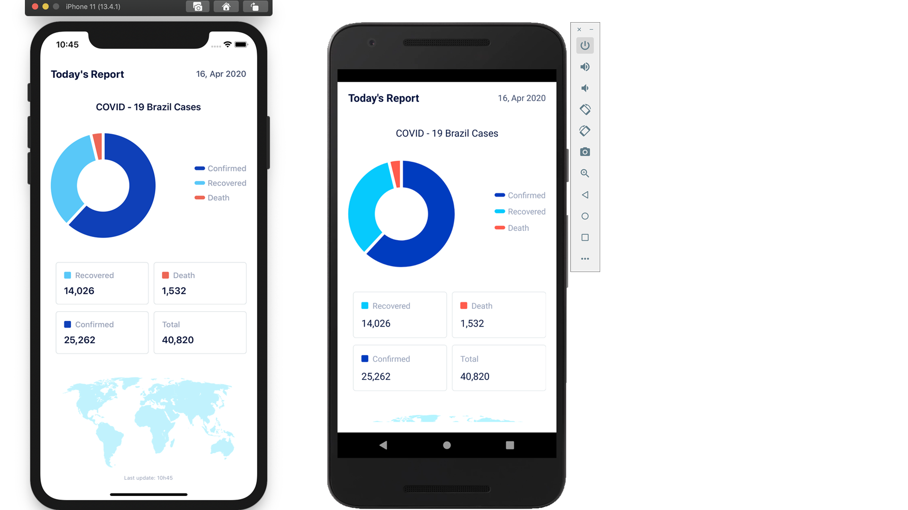

<h4 align="center">
  App to monitor the progress of COVID19 in Brazil
</h4>

  

  
  
  

  
  
  

  <a href="#rocket-Technology">Technology</a>&nbsp;&nbsp;&nbsp;|&nbsp;&nbsp;&nbsp;
  <a href="#-Project">Project</a>&nbsp;&nbsp;&nbsp;|&nbsp;&nbsp;&nbsp;
  <a href="#-How-to-contribute">How to contribute</a>&nbsp;&nbsp;&nbsp;|&nbsp;&nbsp;&nbsp;
  <a href="#memo-License">License</a>

 

  

## :rocket: Technology

This project was developed with the following technologies:

- [Node.js](https://nodejs.org/en/)
- [React](https://reactjs.org)
- [React Native](https://facebook.github.io/react-native/)
- [Expo](https://expo.io/)

## 💻 Project

Covid 19 is a simple app for tracking data on the pandemic in Brazil.

## 🤔 How to contribute

- Fork this repository;
- Create a branch with your feature: `git checkout -b my-feature`;
- Commit your changes: `git commit -m 'feat: My new feature'`;
- Push to your branch: `git push origin my-feature`.

After the merge of your pull request is done, you can delete your branch.

## Descrição:

Autor: Alisson de Andrade Araujo"

<h1 align="center">
    
</h1>

 - [Linkedin](https://www.linkedin.com/in/alisson-de-andrade-ara%C3%BAjo-160224190)

- [Instagram](https://www.instagram.com/alissonandradercc)

- [Github](https://github.com/alissonandrade2020/)

## CONHEÇA MAIS SOBRE O TRABALHO E CONHECIMENTO DO DEV(ALISSON DE Andrade Araújo):

 - [Curriculum - Alisson de Andrade Araújo](https://alissonandradesistema.000webhostapp.com/curriculo/)

- [Site de Apresentação de Alisson de Andrade Araújo](http://alissondeandradearaujo.000webhostapp.com)

 - [Sistema de Cadastros de Alunos e Cursos](https://alissonandradesistema.000webhostapp.com/)
 
 - [Ecoleta](https://alisssonecoleta.herokuapp.com/)

 - [Covid-19 - Salgado de São Félix - PB](https://salgadodesaofelixcovid19.netlify.app/)
 
 - [Covid-19](https://alissonandradesistema.000webhostapp.com/covid-19/)
 
  - [Féliz Aniversário](https://alissonandradesistema.000webhostapp.com/felizaniversario/)
  
  - [Féliz Dia das Mães](https://alissonandradesistema.000webhostapp.com/felizdiadasmaes/)

 - [Féliz Páscoa](https://alissonandradesistema.000webhostapp.com/felizpascoa)
 
  - [Clone do Netflix](https://alissonandradesistema.000webhostapp.com/netflixclone/)
    
  - [Clone do Discord](https://alissondiscord.netlify.app/)

- [Sitestema de Cadastro de Empresas - Node.js, React, React Native, Expo](https://alissonandradesistema.000webhostapp.com/react/)

 - [Sistema de Achar Dev's pelo GitHub - Node.js, React, React Native, Expo](https://alissonandradesistema.000webhostapp.com/reactnative)

- [Sistema de Achar Dev's pelo GitHub - Node.js, React, React Native, Expo](https://alissonandradesistema.000webhostapp.com/reactnativetindev)

- [Simulação de Loja Virtual](https://alissonandradesistema.000webhostapp.com/temadark)
 
- [Site e sistema de loja virtual - Node.js, React, React Native, Expo](https://alissonandradesistema.000webhostapp.com/lojavirtual)

- [Site e sistema - Node.js, React, React Native, Expo](https://alissonandradesistema.000webhostapp.com/sistemas/)

- [Sistema de Cadastro de Sala para alugar espaço para reuniões de empresas - Node.js, React, React Native, Expo](https://alissonandradesistema.000webhostapp.com/reactnativeaircnc)

- [Sitestema de Apresentação do Trabalho ESAT/ESPEP - cadastro de alunos](https://alissondeaaraujo.000webhostapp.com/index.html)

- [Site de Apresentação 2 de Alisson de Andrade Araújo](https://alissodeaaraujo.000webhostapp.com/index.html)

:vulcan_salute::vulcan_salute: ***OBRIGADO PELO CARINHO E ATENÇÃO !!***  :vulcan_salute::vulcan_salute:
